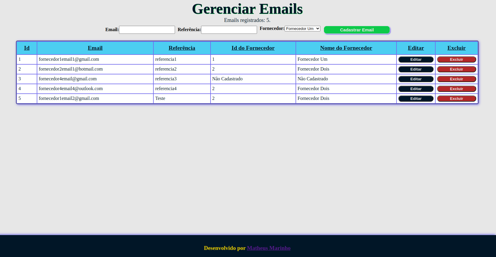

# Frontend gerenciador de vendas

Neste repositório contém o frontend da aplicação pedida, desenvolvido por [Matheus Marinho](https://www.linkedin.com/in/matheus-marinhodsp/), aplicação em **React** utilizando arquitetura por função e arquivos com a extensão **jsx**, utiliza a biblioteca **axios** para se comunicar com o backend fazendo requisições de GET, POST, PUT e DELETE, e estilizando usando o método de styled components para a estilização da página, e o BrowserRouter para definir as rotas das páginas.

---

## Importante

- Para garantir total funcionamento da aplicação garanta que o serviço de backend está rodando normalmente e sem erros na porta **3001**, caso o backend esteja rodando em outra porta será necessário alterá-la em todos os arquivos da pasta **Pages** ou se desejar apenas uma rota específica altere somente no arquivo referente a tal rota.

- Após tudo estar devidamente correto é só clonar o repositório com o comando:
```bash
git clone git@github.com:matheusnff85/gigalink-gerenciador-frontend.git
```
e em seguida instalar suas dependências com o comando `npm install` na raiz do diretório, e após isso para visualizar a aplicação em seu navegar é só utilizar o comando `npm start` depois de suas dependências serem devidamente instaladas.

---

## Imagens

- Tela inicial


- Tela de gerenciamento

